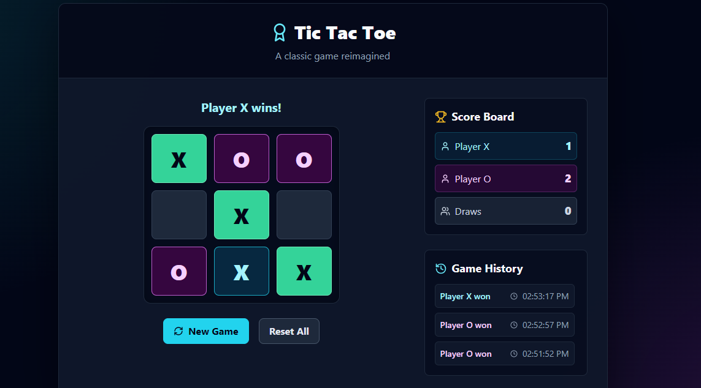
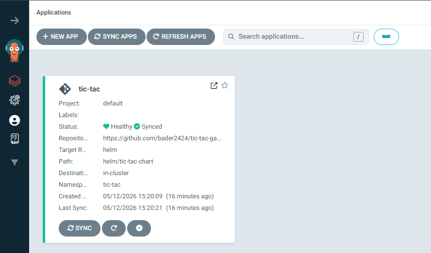
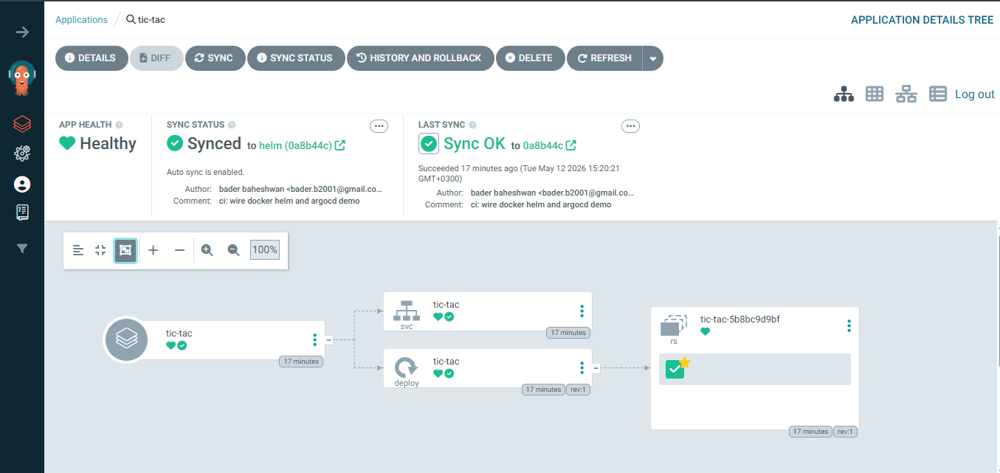
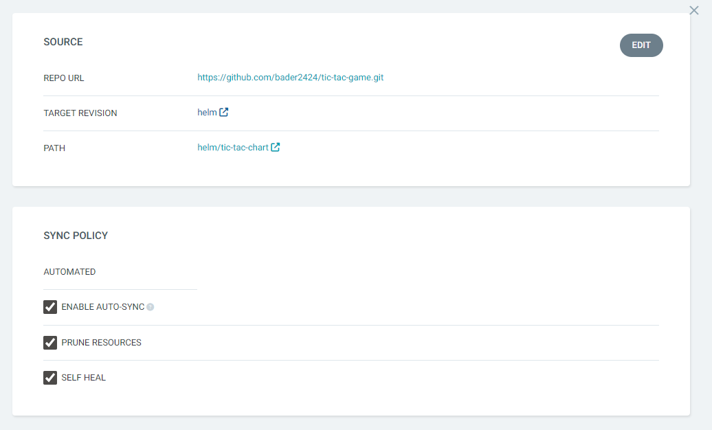
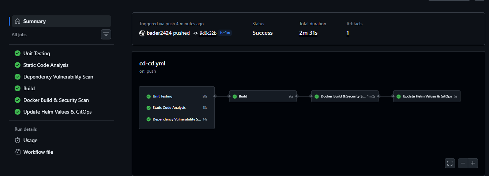

# Tic Tac Toe Game

A React, TypeScript, and Tailwind CSS Tic Tac Toe game with a dark UI, score tracking, game history, and Docker support.

## Project Screenshots

### Application UI

Dark themed gameplay with score tracking and game history.



### GitOps Deployment With Argo CD

Argo CD tracks the `helm` branch and deploys the Helm chart from `helm/tic-tac-chart`.



The application is synced and healthy, with Kubernetes resources managed from the Helm chart.



The Argo CD source and sync policy show the Git repository, target revision, chart path, automated sync, prune, and self-heal settings.



### CI/CD Pipeline

GitHub Actions runs quality gates, builds the Docker image, scans it, pushes it, and updates Helm values for GitOps deployment.



## Features

- Fully functional Tic Tac Toe gameplay
- Score tracking for Player X, Player O, and draws
- Game history with timestamps
- Winning combination highlights
- Reset current game or all statistics
- Responsive dark theme
- Dockerized production build with Nginx

## Technologies Used

- React 18
- TypeScript
- Vite
- Tailwind CSS
- Lucide React
- Docker
- Docker Compose

## Project Structure

```text
src/
  components/
    Board.tsx
    Square.tsx
    ScoreBoard.tsx
    GameHistory.tsx
  utils/
    gameLogic.ts
  App.tsx
  main.tsx

helm/
  tic-tac-chart/
```

## Local Development

Install dependencies:

```bash
npm install
```

Run the Vite development server:

```bash
npm run dev
```

Open:

```text
http://127.0.0.1:5173
```

## Production Preview Without Docker

Build the app:

```bash
npm run build
```

Run the built app locally:

```bash
npm run preview -- --host 0.0.0.0 --port 4173
```

Open:

```text
http://127.0.0.1:4173
```

## Run With Docker

For this app, Docker Compose is the simplest option because the project has one web container and Compose gives a short, repeatable command with the port mapping included.

If Docker Desktop is not running, use Rancher Desktop instead. Rancher Desktop can run this same Compose file through `nerdctl compose`.

Build and start the app:

```bash
docker compose up --build
```

Open:

```text
http://127.0.0.1:8080
```

Run in the background:

```bash
docker compose up --build -d
```

Stop the app:

```bash
docker compose down
```

## Run With Rancher Desktop

Use this when Docker Desktop is broken or closed.

Make sure Rancher Desktop is running, then start the app with:

```powershell
& "C:\Program Files\Rancher Desktop\resources\resources\win32\bin\nerdctl.exe" compose up --build -d
```

Open:

```text
http://127.0.0.1:8080
```

Stop the app:

```powershell
& "C:\Program Files\Rancher Desktop\resources\resources\win32\bin\nerdctl.exe" compose down
```

## Run With Plain Docker

If you do not want to use Compose:

```bash
docker build -t tic-tac-game:local .
docker run --rm -p 8080:80 tic-tac-game:local
```

Open:

```text
http://127.0.0.1:8080
```

## Quality Checks

```bash
npm run lint
npm run test
npm run build
```
